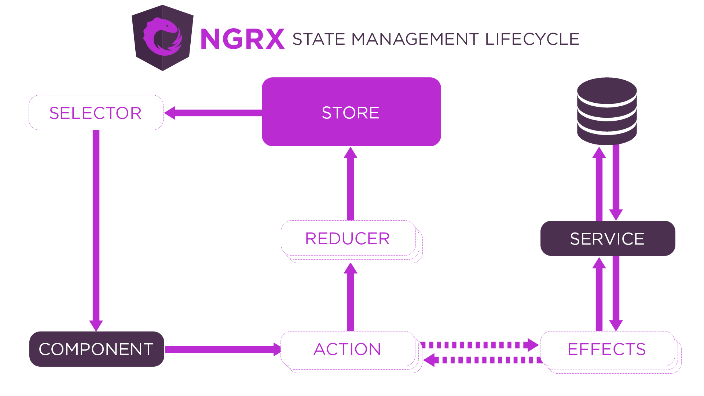
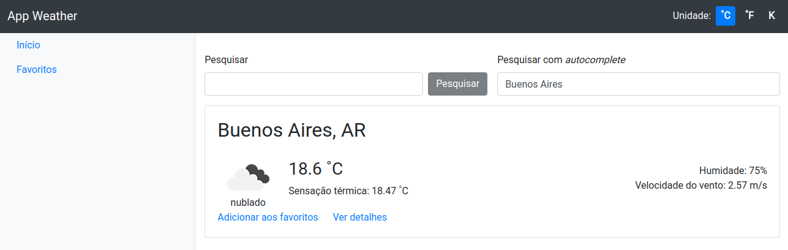

# App Weather


Este projeto foi feito baseado nas aulas da Digital Innovation One, com o título: Criando projeto para consultar a previsão do tempo via API.

É uma aplicação de previsão do tempo utilizando Angular como tecnologia front-end cosumindo uma API externa, a [OpenWeather](https://openweathermap.org/).

> **Obs.**:
> 
> Faça o cadastro no site do OpenWeather e após obter a chave da API, adicione em: `src/environments`.

Foi utilizado o [NgRx](https://ngrx.io/), que é um gerenciador de estado e fluxo global da aplicação. O seu uso ajuda a centralizar informações e o gerenciamento da aplicação.

A imagem a seguir ([retirada do site](https://ngrx.io/guide/store)) representa o fluxo geral do estado da aplicação no NgRx.

<kbd>
    
</kbd>

- **Store** é onde o estado da aplicação será armazenado.

- **Actions** descrevem todos os eventos possíveis e exclusivos que podem ocorrer na aplicação. Podem ocorrer por: interação do usuário, comunicação com o servidor ou resultado de outras ações.

- **Reducer** une as ações e o estado quando há mudanças de estado decorrente de uma ação. Essas mudanças são tratadas por funções puras, que pegam o estado atual e a ação mais recente e calculam o novo valor do estado.

- **Selector** é usado para recuperar parte do estado em que determinado componente pode estar interessado.

- **Effects** é quem lida com as chamadas assíncronas externas.


## Executando a aplicação

Antes de iniciar a aplicação, deve-se rodar o comando ```npm install``` para instalar as dependências do projeto.

Após instalar as dependências necessárias, iniciamos a aplicação com o seguinte comando:
```
$ npm start
OU
$ ng serve
```

Isso irá iniciar o front-end no endereço `http://localhost:4200/`. A aplicação irá atualizar automaticamente sempre que existir uma modificação.


## Tela da aplicação

<kbd>
    
</kbd>

