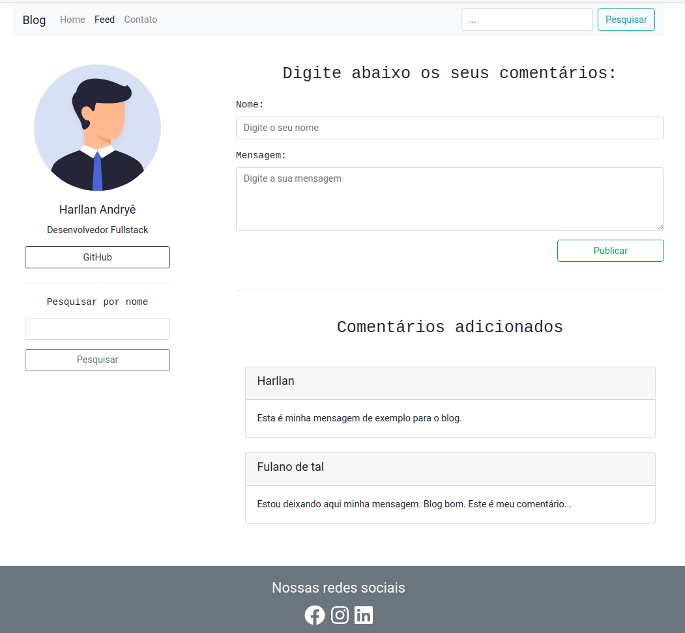

# Blog


Este projeto foi feito baseado nas aulas da Digital Innovation One. Foi construída uma API com Json-Server e os dados são consumidos em um feed de mensagens desenvolvido em Angular.

O que foi utilizado no projeto:
- [Json-Server](https://github.com/typicode/json-server);
- [Bootstrap](https://getbootstrap.com/);
- [Font Awesome](https://fontawesome.com/);
- [Sweetalert2](https://sweetalert2.github.io/)
- [Angular](https://angular.io/).

## Executando a aplicação

Antes de iniciar a aplicação, deve-se rodar o comando ```npm install``` para instalar as dependências do projeto. Isso nas pastas do backend e frontend.

Após instalar as dependências necessárias, iniciamos a aplicação com o seguinte comando:

- frontend: `$ ng serve -o`

- backend: `$ npm start`

Para o backend, o endereço será `http://localhost:3000/posts`.

Já no frontend, irá iniciar no endereço `http://localhost:4200/`. A aplicação irá atualizar automaticamente sempre que existir uma modificação.

## Tela da aplicação

A seguir temos um exemplo de uma das páginas da aplicação.

<p align="center">
    <kbd >
        
    </kbd>
</p>
