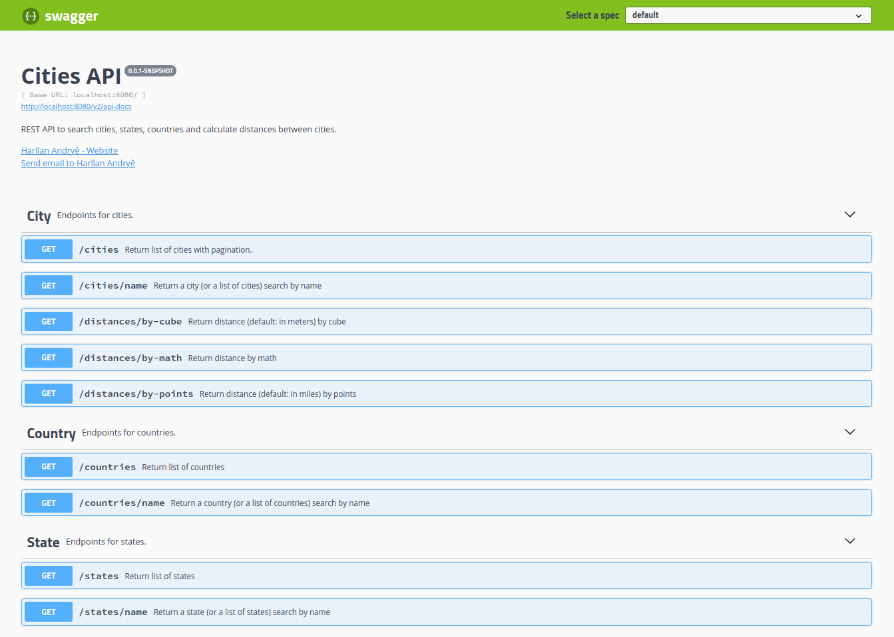

# Cities API


Este projeto foi feito baseado nas aulas da Digital Innovation One, com o título: Construindo uma API Rest de consulta de cidades do Brasil do zero até a produção.

Descrição:
- Neste projeto você terá o desafio de desenvolver uma API Rest de consulta de cidades do Brasil com dados comparativos. Iremos navegar pelas boas práticas de Java e do Spring, popular o banco de dados PostgreSQL e criar um serviço para o cálculo de distância entre cidades.


Projeto com:
- Java 11;
- Maven;
- Spring Boot 2.5.6;
- Banco de dados PostgreSQL;
- Swagger.


### PostgreSQL

Foi utilizado o banco de dados PostgreSQL, mas antes de iniciar a aplicação é necessário criar as tabelas e popular as mesmas.

Crie um banco de dados com o nome `cities` e execute os scripts [deste link](https://github.com/chinnonsantos/sql-paises-estados-cidades/tree/master/PostgreSQL) para criar as tabelas de cidades, estados e países.

Além disso é necessário adicionar algumas extenções para efetuar os cálculos de distância entre cidades:

```
CREATE EXTENSION cube; 
CREATE EXTENSION earthdistance;
```
- [Saber mais](https://www.postgresql.org/docs/current/earthdistance.html)

Algumas queries para exemplo de como calcular a distância:

Point (retorna a distância em milhas)
```roomsql
select ((select lat_lon from cidade where id = 4929) <@> (select lat_lon from cidade where id=5254)) as distance;
```

Cube (retorna a distância em metros)
```roomsql
select earth_distance(
    ll_to_earth(-21.95840072631836,-47.98820114135742), 
    ll_to_earth(-22.01740074157715,-47.88600158691406)
) as distance;
```

### :computer: Rodar a aplicação
---

Para executar o projeto no terminal, digite o seguinte comando:

```shell script
$ mvn spring-boot:run
```

Após executar o comando acima, o seguinte endereço da API estará disponível: `
http://localhost:8080`.

Para executar os testes desenvolvidos, execute o seguinte comando:

```shell script
$ mvn clean test
```

Foi utilizado o Swagger 2 para Spring REST web service, usando a biblioteca [Springfox](https://github.com/springfox/springfox).
O Springfox irá retornar um JSON com as informações da documentação da API e para verificar se está funcionando, acesse: 

```
http://localhost:8080/v2/api-docs
```

Mas, para melhor visualização das informações, usamos o Swagger UI, no endereço:

```
http://localhost:8080/swagger-ui.html
```

<kbd>
  
</kbd>

<br>
<br>
