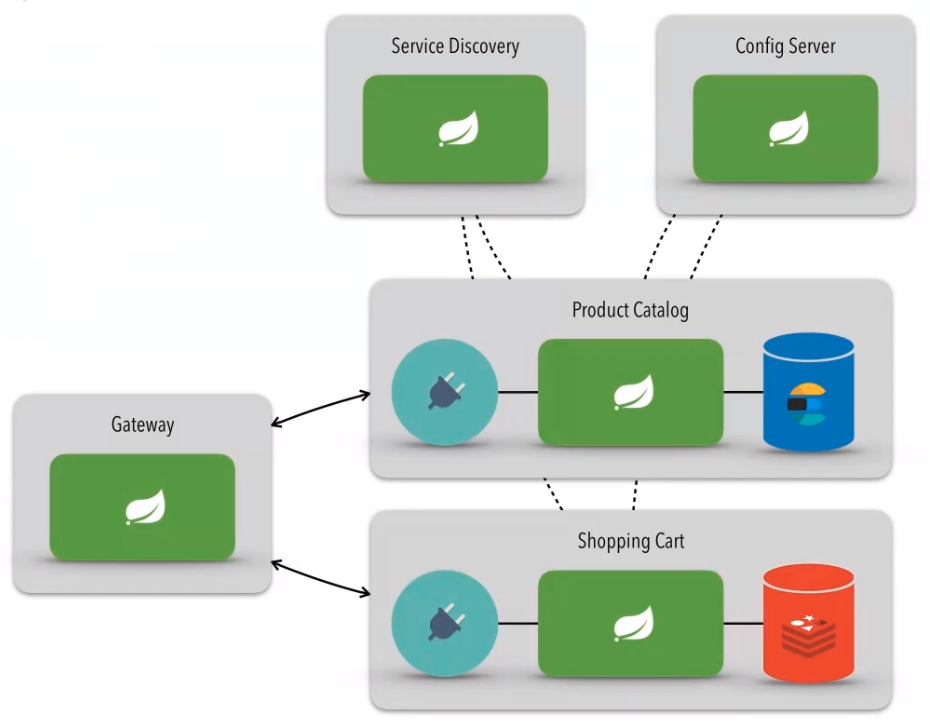

# Aplicações baseadas em microsserviços

- Config Server: centralizar as configurações dos serviços (aplicações).
- Service Discovery: Gerencia os serviços. É ele que tem o mapeamento de onde cada serviço está, qual a URL, porta...
- Gateway: Ajuda a expor o sistema. Para acessar os serviço tem que ser por meio do gateway.

### Arquitetura

<kbd>
  
</kbd>

