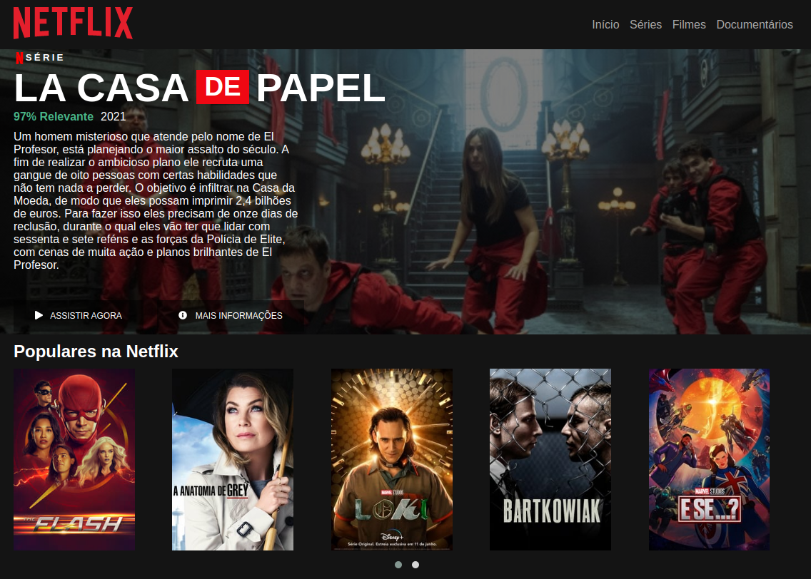

# Recriando interface do Netflix

Este projeto foi feito baseado nas aulas da Digital Innovation One, com o título: Recriando a Interface do Netflix.

Utilizando tecnologias simples como HTML5, CSS3 e JavaScript, nas aulas foi apresentado como estruturar um layout, técnicas de CSS3 com containers e variáveis, como posicionar os elementos com Flexbox e como utilizar plugins JQuery a favor da sua aplicação.

Também foi utilizado:
- [Font Awesome](https://fontawesome.com/)
- [Owl Carousel 2](https://owlcarousel2.github.io/OwlCarousel2/)

Foi criada apenas uma página simples, semelhante a imagem abaixo:

    <kbd >
        
    </kbd>

